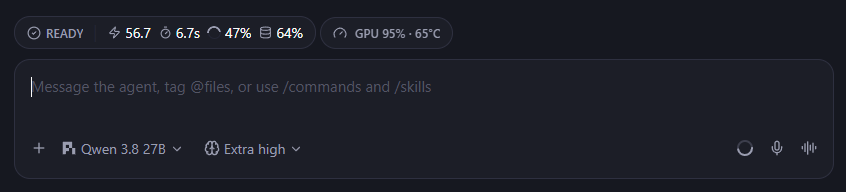
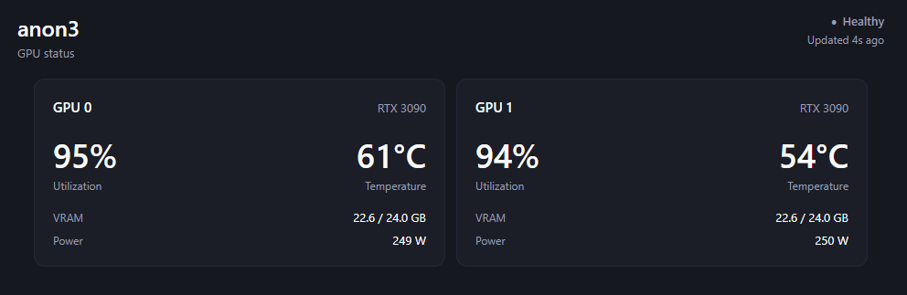

# Paseo Prometheus Status

A Paseo v0.7 plugin that shows the highest GPU utilization and temperature from Prometheus in every active agent composer. Press the pill to open a compact per-GPU inspector with utilization, temperature, VRAM, and power.

## Preview

The composer pill keeps the busiest utilization and hottest temperature visible at a glance. Click it to open the full inspector.



The status pane shows utilization, temperature, VRAM, and power for each GPU.



## Data source

Prometheus is the only data source. The plugin queries these NVIDIA DCGM exporter metrics:

- `DCGM_FI_DEV_GPU_UTIL`
- `DCGM_FI_DEV_GPU_TEMP`
- `DCGM_FI_DEV_FB_USED`, `DCGM_FI_DEV_FB_FREE`, and `DCGM_FI_DEV_FB_RESERVED`
- `DCGM_FI_DEV_POWER_USAGE`

The plugin connects only to the configured Prometheus endpoint and does not connect directly to GPU hosts.

## Configuration

The plugin automatically creates `paseo-prometheus-status.json` in the Paseo home directory the first time it requests GPU status. The default locations are:

- Windows: `%USERPROFILE%\.paseo\paseo-prometheus-status.json`
- macOS and Linux: `~/.paseo/paseo-prometheus-status.json`
- Custom home: `$PASEO_HOME/paseo-prometheus-status.json`

The generated file looks like this:

```json
{
  "prometheusUrl": "",
  "selector": "",
  "hostLabel": "GPU host",
  "showHostLabelInPill": false
}
```

Set `prometheusUrl` to the Prometheus base URL visible from the Paseo daemon. Set `selector` to the contents of a PromQL label selector that identifies the intended DCGM exporter or GPU host; do not include the surrounding braces:

```json
{
  "prometheusUrl": "http://prometheus.example:9090",
  "selector": "job=\"dcgm-exporter\",instance=\"gpu-host.example:9400\"",
  "hostLabel": "Inference server",
  "showHostLabelInPill": false
}
```

With `showHostLabelInPill` set to `false`, the composer shows a compact summary such as `GPU 42% · 63°C`. Set it to `true` to include `hostLabel`, for example `Inference server · GPU 42% · 63°C`. The full status pane always shows the host label.

After saving the file, reload the plugin:

```bash
paseo plugin reload paseo-prometheus-status
```

The file is also reread whenever the plugin refreshes its 10-second cache, so most saved changes appear automatically within 10 seconds. Reloading applies them immediately. Invalid JSON or invalid value types are shown as an unavailable state with the configuration error.

### Advanced query overrides

The selector is inserted between `{` and `}` in every default query. Advanced users can replace individual complete PromQL queries by adding any of these optional properties to the JSON object:

```json
{
  "gpuQuery": "DCGM_FI_DEV_GPU_UTIL{job=\"dcgm-exporter\"}",
  "temperatureQuery": "DCGM_FI_DEV_GPU_TEMP{job=\"dcgm-exporter\"}",
  "memoryUsedQuery": "DCGM_FI_DEV_FB_USED{job=\"dcgm-exporter\"}",
  "memoryTotalQuery": "DCGM_FI_DEV_FB_USED{job=\"dcgm-exporter\"} + DCGM_FI_DEV_FB_FREE{job=\"dcgm-exporter\"} + DCGM_FI_DEV_FB_RESERVED{job=\"dcgm-exporter\"}",
  "powerQuery": "DCGM_FI_DEV_POWER_USAGE{job=\"dcgm-exporter\"}"
}
```

### Environment-variable overrides

Environment variables remain available for containers and automated deployments. They override matching values from the JSON file:

- `PASEO_PROMETHEUS_URL`
- `PASEO_PROMETHEUS_SELECTOR`
- `PASEO_PROMETHEUS_HOST_LABEL`
- `PASEO_PROMETHEUS_SHOW_HOST_LABEL_IN_PILL`
- `PASEO_PROMETHEUS_GPU_QUERY`
- `PASEO_PROMETHEUS_GPU_TEMPERATURE_QUERY`
- `PASEO_PROMETHEUS_GPU_MEMORY_USED_QUERY`
- `PASEO_PROMETHEUS_GPU_MEMORY_TOTAL_QUERY`
- `PASEO_PROMETHEUS_GPU_POWER_QUERY`

Environment-variable changes require restarting the Paseo daemon so the plugin process inherits them. JSON-file changes do not.

The collector and clients refresh every 10 seconds. A sample older than 30 seconds is shown as stale. A missing or unreachable Prometheus URL is shown as offline in the plugin UI.

## Development

```bash
npm install
npm run typecheck
paseo plugin install /absolute/path/to/paseo-prometheus-status
```

After source changes:

```bash
npm run typecheck
paseo plugin reload paseo-prometheus-status
```
